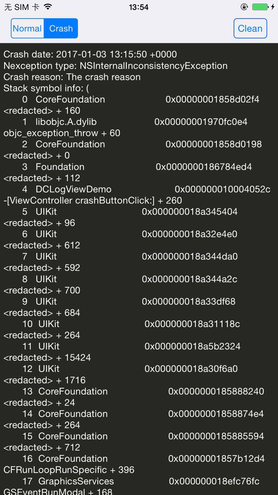

# DCLog
DCLog can print log and crash information on your Device screen, when you shake your Device.

[](https://github.com/DarielChen/DCLog/blob/master/LICENSE)

## What is DCLog?
[中文介绍在这里:iOS摇一摇在屏幕上实时显示log和crash日志](http://www.jianshu.com/p/94b96ac1932b)

DCLog is a lightweight tool, when you want to show log and crash information on your device screen.

 
 
 
## How to use?


```objective-C

- (BOOL)application:(UIApplication *)application didFinishLaunchingWithOptions:(NSDictionary *)launchOptions {
    
    [DCLog setLogViewEnabled:YES];
    return YES;
}

```

When you shake your device,the logView will show or hidden.