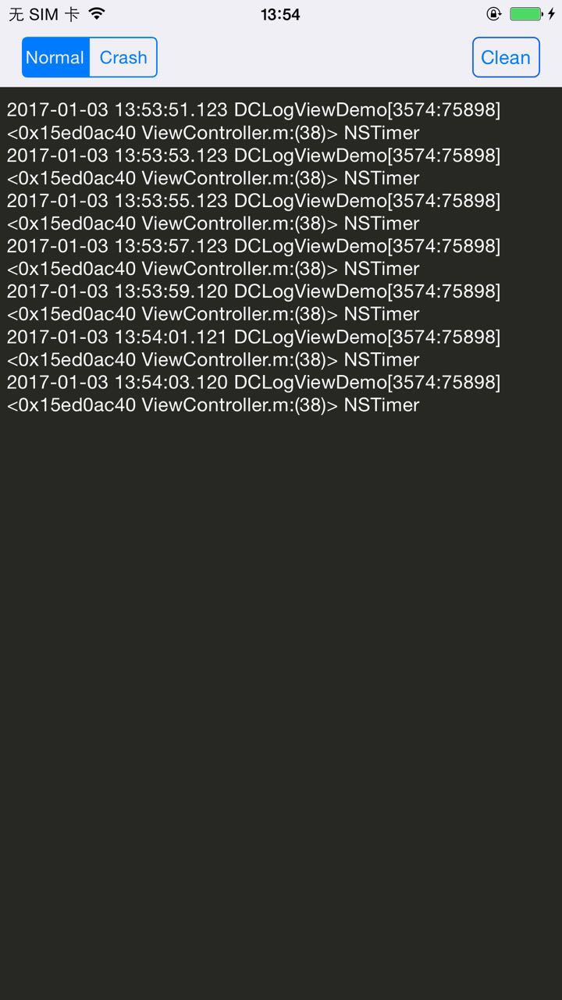

# DCLog
DCLog can print log and crash information on your Device screen, when you shake your Device.

[](https://github.com/DarielChen/DCLog/blob/master/LICENSE)

## What is DCLog?

DCLog is a lightweight tool, when you want to show log and crash information on your device screen.

 
 
 
## How to use?


```objective-C

- (BOOL)application:(UIApplication *)application didFinishLaunchingWithOptions:(NSDictionary *)launchOptions {
    
    [DCLog startRecord];
    return YES;
}

- (void)motionBegan:(UIEventSubtype)motion withEvent:(UIEvent *)event {

    if (event.type == UIEventSubtypeMotionShake) {
        [DCLog changeVisible];
    }
    
}

```

When you shake your device,the logView will show or hidden.